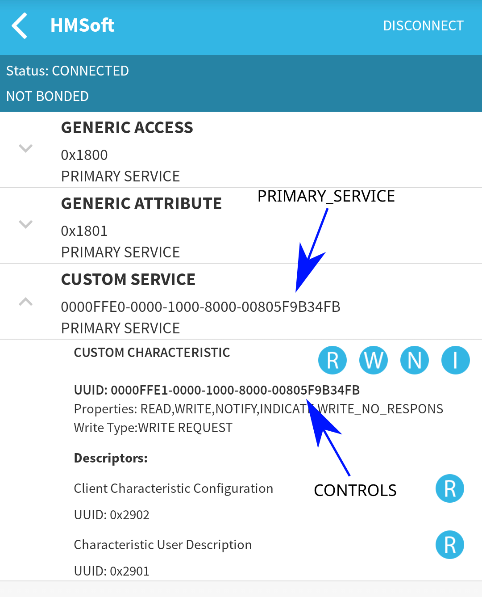

# robo-control

A simple Vue project designed to control [Ks0428 keyestudio Mini Tank Robot V2](https://wiki.keyestudio.com/Ks0428_keyestudio_Mini_Tank_Robot_V2) using JavaScript Bluetooth APIs

## Requirements

- A Chromium based browser (Google Chrome, Vivaldi etc.)
- Experimental Web Platform features enabled (using `chrome://flags/#enable-experimental-web-platform-features`)

## Project Setup

Use your preffered package manager to download required libraries:

```sh
npm install
# or
yarn install
# or
bun install
```

Run the project:

```sh
npm run dev
# or
yarn dev
# or
bun dev
```

## Connecting to the robot

Once you enable required features in your browser you should be able to pair with your robot over Bluetooth using browser dialog. If the robot doesn't show up during the scanning process you might need to update UUIDs that are used to filter out the device list.

In order to retrieve required information you can use a mobile application like [BLE Scanner](https://play.google.com/store/apps/details?id=com.macdom.ble.blescanner)

Once you get the app and connect to your robot take the following values and edit them accordingly in `src/components/ControllerContainer.vue` file



## Controls

You will be able to control your robot once you successfully connect to your robot. By default the robot is set to wait for directions commands from controlling device. 
Commands are based on the code available from from `Lesson 15` of the documentation page. The standard control movements (forward, backwards etc.) are bound to WASD keys. You are also able to use three different control modes of the robot. Those being:
- Follow mode
- Avoid obstacles mode
- Follow light mode

If the code you uploaded to your robot expects different commands to be used to controll it adjust them accordingly in `src/components/comtrols/RobotSteering.vue`
